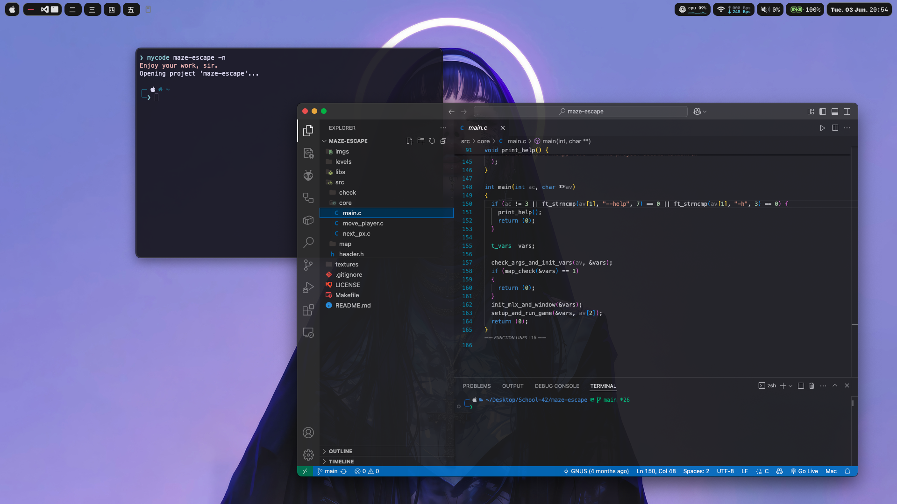
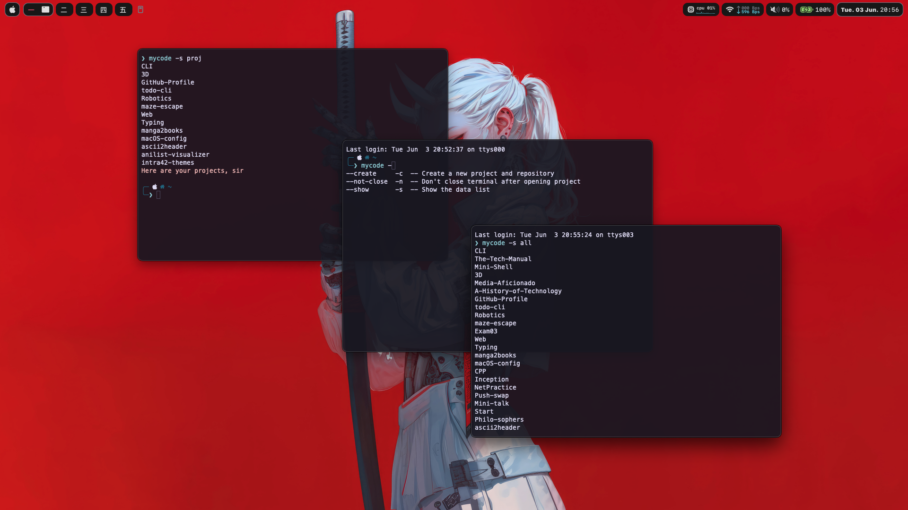

<div align="center">
  
</div>

<br>

<div align="center">

[](https://github.com/marsdevx/mycode/commits/main "Last Commit")
[](https://github.com/marsdevx/mycode "Platforms")
<br>
[](https://github.com/marsdevx/mycode "Languages")
[](https://docs.github.com/en/rest "GitHub API")
[](https://github.com/marsdevx/mycode "Shell Support")
[](https://github.com/marsdevx/mycode/blob/main/LICENSE "License")

</div>

---

# 📂 MyCode

**Mycode** is a **terminal**-based, **cross-platform** application built with **Python**, designed to help developers efficiently **manage** and **organize** their work projects on **macOS** and **Linux**. With a customizable mycoderc config file, this tool brings **clarity**, **automation**, and **speed** to your **development workflow**.

* Organize your **projects** by **groups** using a simple, readable **config file**.
* Instantly view what **projects** you’ve worked on recently and in what order.
* Open any project in **Visual Studio Code** directly from the **terminal**—with optional **terminal auto-close**.
* Store your **GitHub credentials** locally and securely in a **.json** file for quick reuse.
* Create **new projects** with a single command:
  - Instantly create a private **GitHub** repo,
  - **Clone** it to a local folder,
  - Add **default** **README** and **.gitignore**,

Take control of your dev life with this smart and simple CLI utility that works seamlessly across macOS and Linux!

---

## 🖼️ Preview

<div align="center">
  
  
</div>

---

## 🛠️ Installation

To install this project, Launch the Terminal app on your system, and run the commands below. <br>
  - If a pop-up appears prompting you to download the Xcode Command Line Tools after the first command, click “Download” and then run the first command again.

1. **Install mycode**
```bash
brew tap marsdevx/mycode
brew install mycode
```

2. **Set up mycoderc file**
> After the first launch of the program, a default configuration file will be created at: `~/.config/mycode/mycoderc`
```bash
💾 Configuration File Rules:
  - `--add <path>`: Adds all subfolders in the specified path to global projects.
  - `--addspecific <path>`: Adds only the specified folder to global projects.
  - `--remove <path> --from <path>`: Excludes a specific subfolder from a parent path.

🔗 Grouping Projects:
Groups can be defined using `[group:group_name]` syntax in the configuration file.
  - Group-specific rules:
      - `--add <path>`: Adds subfolders to the group only.
      - `--addspecific <path>`: Adds only the specified folder to the group.
      - `--remove <path> --from <path>`: Excludes a specific subfolder in the group.
  - Example:
      [group:example_group]
      {
          --add ~/example/path
          --addspecific ~/example/specific_project
          --remove ~/example/path/excluded_folder --from ~/example/path
      }
```

3. **Set up Shell Autocompletion**
> Make sure to add the following to your shell config (e.g. ~/.zshrc or ~/.bashrc):
```bash
autoload -Uz compinit bashcompinit
compinit
bashcompinit

eval "$(register-python-argcomplete mycode)"

_mycode() {
  if (( CURRENT > 2 )) &&
      [[ ${words[CURRENT-2]} == --create || ${words[CURRENT-2]} == -c ]]; then
    _files
    return
  fi

  if (( CURRENT > 1 )) &&
      [[ ${words[CURRENT-1]} == --create || ${words[CURRENT-1]} == -c ]]; then
    return
  fi

  _python_argcomplete "$@"
}

compdef _mycode mycode
```

> Then run:
```bash
source ~/.zshrc
or
source ~/.bashrc
```

---

## 🚀 Usage

- `mycode -s all`  
  Show all global projects defined in your config.

- `mycode -s groups`  
  Show all available groups and the projects within them.

- `mycode -s <group_name>`  
  Show all projects in the specified group.

- `mycode <project_name>`  
  Open the specified project in **Visual Studio Code** and automatically close the terminal.

- `mycode <project_name> -n`  
  Open the specified project in **VS Code**, but **do not close the terminal**.

- `mycode -c <project_name> <target_dir>`  
  Create a new local project folder and a **private GitHub repository**, generate default files, and push it to GitHub — all in one command.

---

## 📋 License

All the code contained in this repo is licensed under the [MIT License](LICENSE)

```
MIT License

Copyright (c) 2025 marsdevx

Permission is hereby granted, free of charge, to any person obtaining a copy
of this software and associated documentation files (the "Software"), to deal
in the Software without restriction, including without limitation the rights
to use, copy, modify, merge, publish, distribute, sublicense, and/or sell
copies of the Software, and to permit persons to whom the Software is
furnished to do so, subject to the following conditions:

The above copyright notice and this permission notice shall be included in all
copies or substantial portions of the Software.

THE SOFTWARE IS PROVIDED "AS IS", WITHOUT WARRANTY OF ANY KIND, EXPRESS OR
IMPLIED, INCLUDING BUT NOT LIMITED TO THE WARRANTIES OF MERCHANTABILITY,
FITNESS FOR A PARTICULAR PURPOSE AND NONINFRINGEMENT. IN NO EVENT SHALL THE
AUTHORS OR COPYRIGHT HOLDERS BE LIABLE FOR ANY CLAIM, DAMAGES OR OTHER
LIABILITY, WHETHER IN AN ACTION OF CONTRACT, TORT OR OTHERWISE, ARISING FROM,
OUT OF OR IN CONNECTION WITH THE SOFTWARE OR THE USE OR OTHER DEALINGS IN THE
SOFTWARE.
```

---

## ⭐ Support

If you like this project, don’t forget to ⭐ **star** it and **follow** me!  
Your **support** helps me create more projects. 🚀  

🔗 **Explore more of my work on [GitHub](https://github.com/marsdevx?tab=repositories) and discover other exciting projects!**